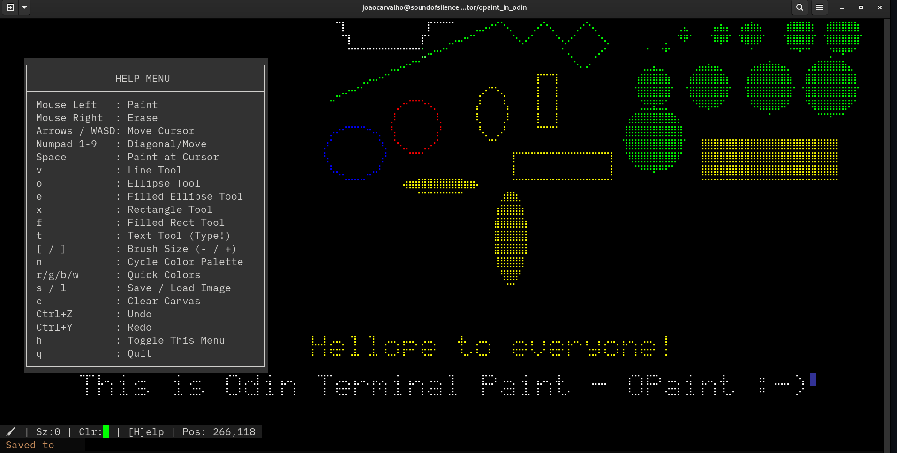
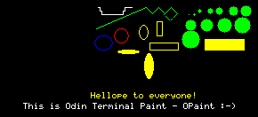

## OPaint - A terminal paint program in Odin
A simple but cute terminal program that uses the Unicode Braille Dots characters.

## Description
This is a terminal paint program that has the main simplified features of a paint program, but for the terminal, it uses the increased terminal resolution provided by the unicode Braille dot character and it's sub decomposition. <br>
You can use it even over SSH :-)

## It has the following features

- Paint brush movement with cursors, keypad, and mouse.
- Draw and erasure with mouse.
- Tools:
  1. Free line
  2. Line
  3. Rectangule
  4. Filled rectangule
  5. Ellipse
  6. Filled Ellipse
  7. Text, with support for Backspace
  8. Multiple brush sizes
  9. Multiple colors
- Save and Load with support for .PPM and .BMP image formats.
- Undo and redo.
- Help menu with keybindings.

## Images





## Compile and run
```
Note: In the Odin compiler dir the vendors/stb src for the
      stb image has to be also compilled, by executing make
      on Linux. 
```

```
make
./opaint
```

## License
MIT Open Source license

## Have fun
Best regards, <br>
Joao Carvalho
